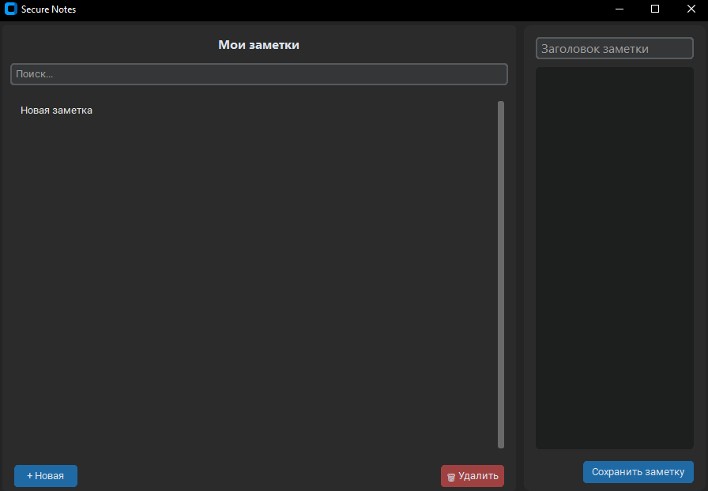

# 🔐 Secure Notes

> Защищённое приложение для заметок с шифрованием AES-256.



## Возможности
- Мастер-пароль для доступа ко всем заметкам.
- Все данные шифруются по алгоритму AES-256.
- Тёмная тема, удобный интерфейс на CustomTkinter.
- Поиск по заметкам.
- Автосохранение при переключении.

## Установка и запуск

```bash
git clone https://github.com/ваш-ник/secure-notes.git
cd secure-notes
pip install -r requirements.txt
python main.py